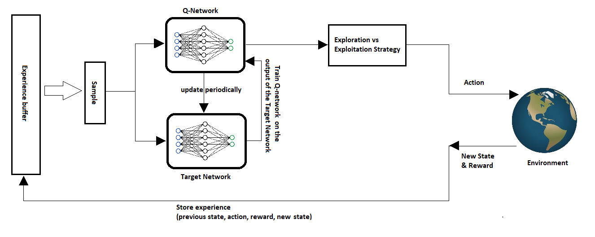
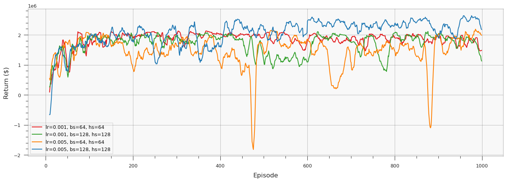
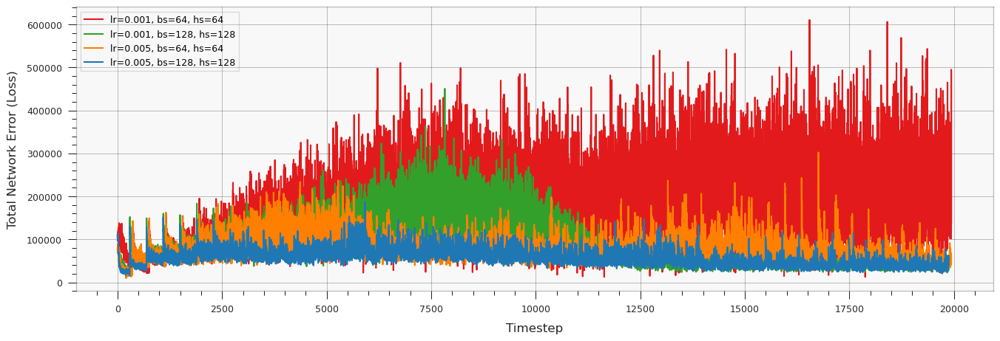

# Dynamic Pricing Optimization using Deep Q-Network (DQN)

This repository contains a project that explores dynamic pricing optimization using Deep Q-Network (DQN) reinforcement learning. The goal is to develop an agent that can learn to set optimal prices over time to maximize profits.

## Project Structure

1. **Environment Setup**
   - **Demand Function**: Defines demand at time `t` based on current price and previous price.

     To solve the dynamic pricing problem, the problem environment must first be defined. For this purpose, we consider the following functions. These functions are also referred to by the same names in the related code.
     $$
     Q_t(P_t, P_{t-1}, q_0, k, a, b) = \text{ReLU}(q_0 - k \cdot P_t - a \cdot \text{ReLU}(P_t - P_{t-1}) + b \cdot \text{ReLU}(P_{t-1} - P_t))
     $$
     where \( q_0 \) is the initial demand, \( k \) is the price elasticity of demand, \( a \) is the coefficient of demand change with respect to price increase, and \( b \) is the coefficient of demand change with respect to price decrease.
    
   - **Profit Function**: Calculates profit at time `t` using the demand function.

     The profit function can be defined using the same components as the demand function as follows:
     $$
     \text{Profit}_t(P_t, P_{t-1}, q_0, k, a, b, u) = Q_t(P_t, P_{t-1}, q_0, k, a, b) \cdot (P_t - u)
     $$
     where \( u \) is the unit cost of the product. The total dollar profit from time \( t=1 \) to \( t=T \) is calculated by summing the profits obtained.
     $$
     \text{Total Profit} = \sum_{t=1}^{T} \text{Profit}_t(P_t, P_{t-1}, q_0, k, a, b, u)
     $$

   - **Initial Parameters**: Environment parameters such as price elasticity, cost per unit, and initial demand.

     By considering the components, the environment or the below plot can be observed based on different percentages of price changes in Figure 1.

     $$
     \begin{align*}
     T &= 20 \\
     p &\in \{10, 20, 30, \ldots, 500\} \\
     q_0 &= 5000 \\
     k &= 20 \\
     u &= 100 \\
     a &= 300 \\
     b &= 100
     \end{align*}
     $$

## Markov Decision Process (MDP) Components

To solve this problem, we define a Markov decision process that includes the following elements:

- **State**: A vector representing previous prices and a binary indicator for time steps. The state is defined as:
  $$
  S_t = [P_t, P_{t-1}, \ldots, P_{t-n}]
  $$
  with the length \( T = 20 \). The first component represents time and the other components represent previous prices.

- **Action**: The price the agent can set at each time step from a predefined set:
  $$
  A_t \in \{10, 20, 30, \ldots, 500\}
  $$

- **Reward**: The profit obtained, calculated using the profit function:
  $$
  R_t = \text{Profit}(P_t, P_{t-1}, q_0, k, a, b, u)
  $$

- **Transition Function**: Defines how the state evolves after taking an action. The next state \( S_{t+1} \) is defined by:
  $$
  S_{t+1} = [P_t, P_{t-1}, \ldots, P_{t-n}]
  $$

This setup allows the agent to decide on the optimal pricing strategy to maximize the total profit over time.
   
## Solving the Problem with a Q-Learning Neural Network Algorithm

To define a neural network with multiple layers, we use libraries like PyTorch or TensorFlow with the Python programming language. In fact, the neural network acts as a function approximator that estimates the value of each action in each state.

### Neural Network Architecture

In this algorithm, we will have a two-architecture neural network. The policy network is responsible for learning the policy function (Policy Network) and the target network is responsible for calculating the target values for learning the policy network (Target Network). The policy network architecture consists of several layers, which can be seen in Table 1. The network has 3 hidden layers, each with 128 neurons and ReLU activation functions. The input layer size corresponds to the size of the state space, and the number of neurons in the output layer corresponds to the size of the action space. The learning rate in this network is \( \eta=0.005 \) and the Adam optimizer is used for weight optimization.

| Layer   | Number of Neurons | Activation Function |
|---------|-------------------|---------------------|
| Input   | 40                | -                   |
| Hidden 1| 128               | ReLU                |
| Hidden 2| 128               | ReLU                |
| Hidden 3| 128               | ReLU                |
| Output  | 49                | -                   |

*Table 1: Neural Network Architecture with Multiple Layers*

### Experience Replay

The experience replay memory is responsible for storing observed transitions in the form of quadruples \((State, Action, Next State, Reward)\). The capacity of this memory is defined as \( N = 2000 \). Each minibatch of 512 random samples is selected and the policy network is updated.

This setup allows the agent to improve its policy by learning from past experiences, enhancing the efficiency and stability of the learning process.

### Learning Algorithm

The experience replay memory stores observed transitions, and the network periodically updates its weights to approximate the Q-value function. This helps the network to converge towards determining the value of each action in each state.

*Figure: The structure of the DQN learning algorithm.*

Using the DQN algorithm, the Q-value update is given by:
$$
y_d = \text{Reward} + \gamma \max (\text{Target Network}(s', a'))
$$
where \( s' \) is the next state, and \( a' \) is the action chosen by the target network. The DQN network updates its weights to minimize the difference between the predicted Q-values and the target Q-values.

### Action Selection

To solve the exploration-exploitation dilemma, we use the epsilon greedy policy. This method chooses a random action with probability epsilon and the best-known action with probability \( 1 - \epsilon \).

The epsilon value is updated over time to gradually shift from exploration to exploitation using the following equation:
$$
\epsilon = \epsilon_{\min} + (\epsilon - \epsilon_{min})e^{\frac{-t}{\text{decay rate}}}
$$
where:
$$
\begin{align*}
\epsilon_{\min} &= 0.05 \\
\epsilon_0 &= 0.9 \\
\text{decay rate} &= 400
\end{align*}
$$

This equation adjusts epsilon over time, reducing the exploration rate and increasing the exploitation rate.

In this setup, the agent improves its policy by selecting actions that maximize the expected reward based on past experiences and the Q-value estimates.

## Training and Results

- **Epsilon-Greedy Strategy**: Balances exploration and exploitation during training.
- **Training Process**: 
  - 1000 episodes with various hyperparameter settings.
  - Periodic updates of the target network from the policy network.
- **Results**: 
  - The combination of hyperparameters that yielded the best performance is highlighted.
  - Plots showing cumulative rewards and learning curves.

